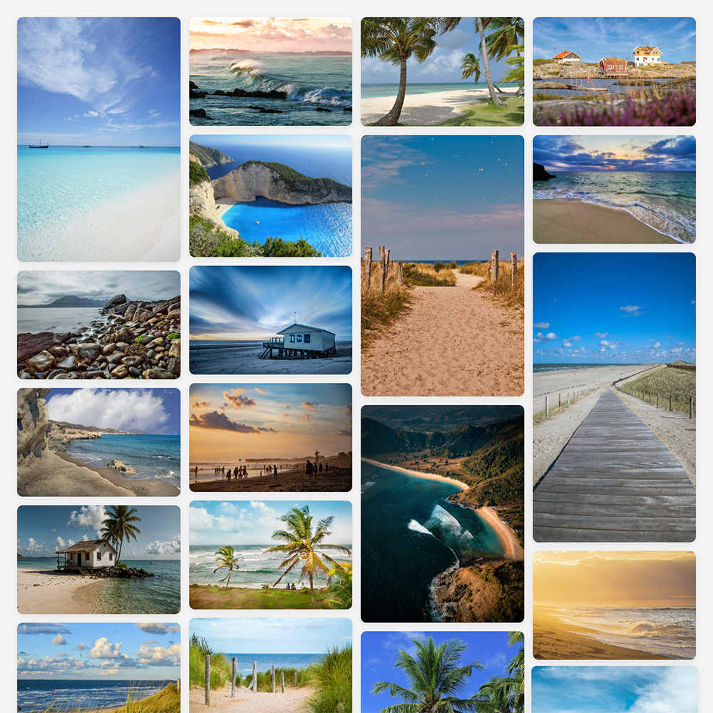

# Snazzy Gallery

A beautiful, modern, fully responsive **single-file** PHP gallery.

Drop `index.php` into any web directory that contains images and/or videos and Snazzy
Gallery displays them in a stunning, masonry-style grid — no configuration, no build step,
no dependencies.



---

## Features

- **Automatic media detection** — scans its own directory for supported images and videos.
- **Responsive masonry layout** — CSS columns give a Pinterest-like, gapless grid that keeps
  each item's aspect ratio. Intrinsic image dimensions are emitted so the grid barely shifts
  while thumbnails load.
- **Image & video support** — `jpg`, `jpeg`, `png`, `gif`, `webp`, `avif`, `svg` and
  `mp4`, `webm`, `mov` (video playback is browser-dependent; `mov` works best in Safari).
- **Lightbox** — click any item to view it fullscreen. Navigate with `←` / `→`, `Home` /
  `End`, swipe left/right on mobile, or press `Esc` to close. Adjacent images are preloaded
  for instant navigation.
- **Shareable deep links** — the open item is reflected in the URL (`…/#p7`), so a link
  reopens straight to that image and a refresh keeps your place.
- **Bandwidth-friendly video** — only metadata loads up front; the full file downloads when
  the video is played, and is released when the lightbox closes.
- **Accessible** — real buttons, full keyboard operation, a focus-trapped dialog that
  restores focus on close, and it honours `prefers-reduced-motion`.
- **Hardened by default** — sends `Content-Security-Policy`, `X-Content-Type-Options`,
  `Referrer-Policy` and `frame-ancestors` headers, and a `noindex` robots tag.
- **Skipped-files hint** — if unsupported files are present, a discreet button reports the
  *formats* that were skipped (never the filenames).
- **No dependencies** — pure PHP, HTML, CSS and a little vanilla JavaScript. No database,
  no frameworks, no build.

---

## Requirements

PHP 7.0 or newer. Works under Apache (`mod_php`), PHP-FPM (nginx, Caddy, …), or the built-in
server (`php -S localhost:8000`).

---

## Usage

1. Copy `index.php` into the directory you want to display.
2. Add your images and/or videos to that same directory.
3. Open the directory in your browser through a web server.

That's it — every supported file in the folder appears in the gallery.

---

## Supported formats

| Kind   | Extensions |
|--------|------------|
| Images | `jpg` `jpeg` `png` `gif` `webp` `avif` `svg` |
| Videos | `mp4` `webm` `mov` |

`index.php`, `*.md`, dotfiles and `favicon.*` are ignored. Any other file is counted in the
"skipped" hint by format only.

---

## Security notes

Snazzy Gallery only ever lists the directory it lives in — it never traverses, and it never
prints the name of a non-media file. It also sets a strict `Content-Security-Policy` on its
own page. Still, keep in mind:

- **The gallery does not protect the folder.** Anything in the directory is still reachable
  by its direct URL (`https://example.com/gallery/notes.pdf`). Put a gallery only in a
  directory whose entire contents may be public.
- **SVG is active content.** A hand-crafted `.svg` can run JavaScript when opened directly
  (not when shown as a thumbnail). If the folder holds files uploaded by other people, either
  remove `svg` from `$allowed_types` at the top of `index.php`, or neutralise SVGs at the
  web-server level, e.g. Apache:

  ```apache
  <FilesMatch "\.svg$">
      Header set Content-Security-Policy "default-src 'none'; style-src 'unsafe-inline'"
      Header set Content-Disposition "attachment"
  </FilesMatch>
  ```

  or nginx:

  ```nginx
  location ~* \.svg$ {
      add_header Content-Security-Policy "default-src 'none'; style-src 'unsafe-inline'";
      add_header Content-Disposition "attachment";
  }
  ```

- The page ships with `<meta name="robots" content="noindex, nofollow">`. Delete that line
  if you *want* search engines to index the gallery.

---

## License

[Snazzy Gallery](https://github.com/ma-tt/snazzy-gallery) © 2025 by [ma-tt](https://github.com/ma-tt) is licensed under [CC BY-NC-SA 4.0](https://creativecommons.org/licenses/by-nc-sa/4.0/).

---

## Credits

Created by [ma-tt](https://github.com/ma-tt).
